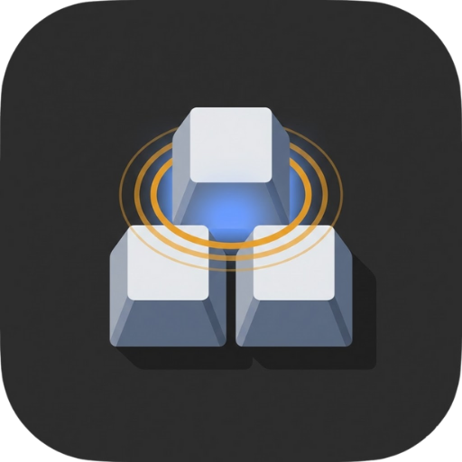

# TapKey

<p align="center">
  
</p>

<p align="center">
  <strong>スマホからMac/PCのキーボードショートカットを発火させるリモコンアプリ</strong>
</p>

<p align="center">
  <a href="https://github.com/tomohiro-owada/TapKey/releases/latest">
    
  </a>
  <a href="https://github.com/tomohiro-owada/TapKey/releases">
    
  </a>
  <a href="https://github.com/tomohiro-owada/TapKey/blob/main/LICENSE">
    
  </a>
</p>

---

## 概要

TapKeyは、スマートフォンをMac/Windows PCのリモートキーボードとして使えるアプリです。カスタマイズ可能なボタンを配置して、ショートカットキーやテキスト入力をワンタップで実行できます。

### 主な用途

- **音声入力アプリの操作** - SuperWhisperなどの録音開始/停止
- **プレゼンテーション** - スライド操作のリモコン
- **動画編集** - よく使うショートカットをワンタップで
- **配信** - OBSのシーン切り替えなど

## ダウンロード

### Mac

| チップ | ダウンロード |
|--------|------------|
| Apple Silicon (M1/M2/M3) | [TapKey_aarch64.dmg](https://github.com/tomohiro-owada/TapKey/releases/latest/download/TapKey_aarch64.dmg) |
| Intel | [TapKey_x64.dmg](https://github.com/tomohiro-owada/TapKey/releases/latest/download/TapKey_x64.dmg) |

### Windows

| アーキテクチャ | ダウンロード |
|--------------|------------|
| 64-bit | [TapKey_x64-setup.exe](https://github.com/tomohiro-owada/TapKey/releases/latest/download/TapKey_x64-setup.exe) |

> **Note**: macOSでは初回起動時に「開発元を確認できない」という警告が出る場合があります。システム環境設定 > セキュリティとプライバシー から「このまま開く」を選択してください。

## 使い方

### 1. アプリをインストール

ダウンロードしたファイルを実行してインストールします。

### 2. アクセシビリティ権限を許可（Mac）

初回起動時にアクセシビリティ権限を求められます。これはキーボード入力をシミュレートするために必要です。

**システム環境設定 > セキュリティとプライバシー > プライバシー > アクセシビリティ** でTapKeyを許可してください。

### 3. スマホからアクセス

1. Mac/PCとスマホを**同じWi-Fiネットワーク**に接続
2. メニューバー（Mac）またはシステムトレイ（Windows）のTapKeyアイコンをクリック
3. 「QRコード表示」を選択
4. スマホでQRコードをスキャン、またはURLを直接入力

### 4. ボタンをカスタマイズ

設定画面の「ボタン設定」タブで：

- **ボタンを追加** - 「+ ボタン追加」をクリック
- **ラベル** - ボタンに表示するテキスト
- **位置とサイズ** - グリッド上の配置を指定
- **色** - ボタンの背景色
- **アクション** - ショートカットキーまたはテキスト入力
- **長押しリピート** - Backspaceなど連打したいキーに

プレビュー上でドラッグ&ドロップでも位置を変更できます。

### 5. PWAとしてホーム画面に追加（推奨）

スマホのブラウザでTapKeyを開いた状態で：

- **iPhone**: 共有ボタン → 「ホーム画面に追加」
- **Android**: メニュー → 「ホーム画面に追加」

これでアプリのように使えます。

## 機能

### ショートカットキー

修飾キー（Cmd, Ctrl, Alt, Shift）と通常キーの組み合わせを設定できます。

例：
- `Cmd + Shift + R` - SuperWhisperの録音開始
- `Cmd + N` - 新規ファイル
- `F5` - プレゼンテーション開始

### テキスト入力 + Enter

定型文を入力してEnterを送信します。チャットでよく使うフレーズなどに。

### 長押しリピート

Backspaceや矢印キーなど、長押しで連続入力したいキーに設定できます。

### PIN認証

不正アクセスを防ぐためPINを設定できます（任意）。

## セキュリティ

- 通信は同一LANネットワーク内のみ
- PIN認証でアクセス制限可能
- ファイアウォールで必要に応じてポートを制限

## 開発

### 必要な環境

- Node.js 18+
- Rust 1.70+
- Tauri CLI

### セットアップ

```bash
# 依存関係をインストール
npm install

# 開発サーバー起動
npm run tauri dev

# ビルド
npm run tauri build
```

## ライセンス

MIT License

## 作者

[@t_wada](https://twitter.com/t_wada)
